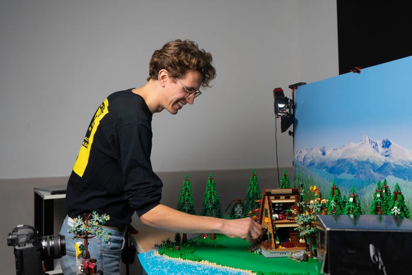
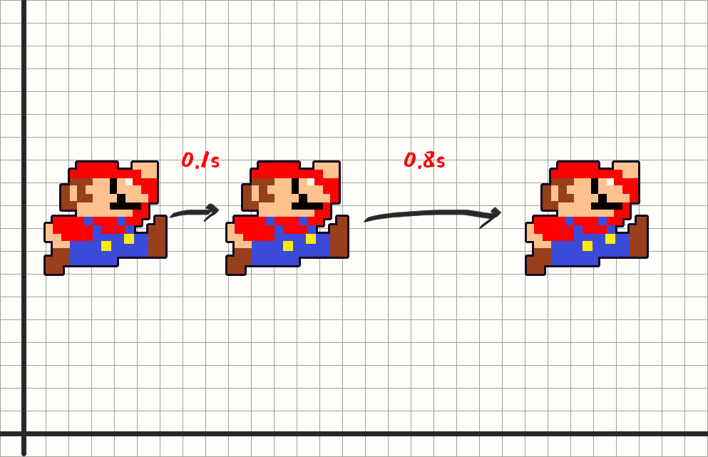
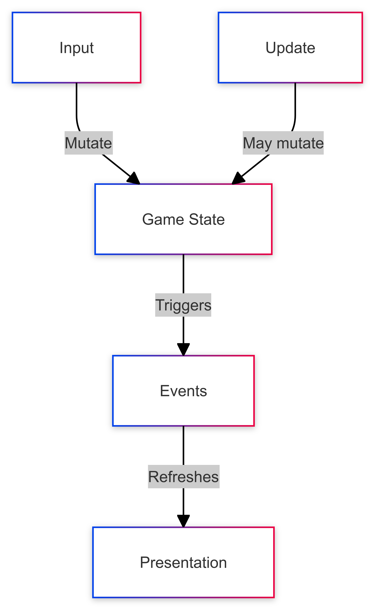
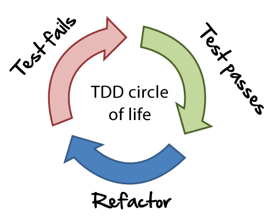

<style>
@import url('https://fonts.googleapis.com/css2?family=Noto+Sans:ital,wght@0,100..900;1,100..900&family=Roboto+Mono:ital,wght@0,100..700;1,100..700&display=swap');
section {
  background-image: url(./assets/DoodlePattern.png);
  background-size: 40%;
  font-family: 'Noto Sans';
}
p, li {
}
h1, h2, h3, li, p {
  text-shadow:
   -10px -10px 0 #fff,
    10px -10px 0 #fff,
    -10px 10px 0 #fff,
     0px 10px 0 #fff,
    -0px -10px 0 #fff,
    10px   0px 0 #fff,
    -10px 0px 0 #fff;

}
</style>

# (eXtreme) Game Development with Phaser

---

## Let's start with the basics

---

## ❓ gamedev... anyone? ❓

---

## Game loop

```js
while (true) {
  /* Update all game objects */
  updateScreen();
}
```

---

## Game loop #2

```js
while (true) {
  for (const gameObject of gameObjects) {
    gameObject.update();
  }
  updateScreen();
}
```

---

## Game loop #3

```js
function updateGame() {
  for (const gameObject of gameObjects) {
    gameObject.update();
  }
  updateCanvas();
  requestAnimationFrame(updateGame);
}

requestAnimationFrame(updateGame);
```

---

### Updating objects
# =
### Changing rotation, position, scale!

---
## Game = cartesian plane


---

## Game = stop-motion movie



---

## 0.0016666666666666667 seconds

---

## BUT... what if the game runs slower?

---

## We have to compensate!



---

## Delta time in Game Loop

```js
let lastTime = Date.now();
function updateGame() {
  const currentTime = Date.now();
  const deltaTime = currentTime - lastTime;
  lastTime = currentTime;

  for (const gameObject of gameObjects) {
    gameObject.update(deltaTime);
  }
  /* Update screen */
}
```

---

## Frame rate independent movement

```js
function update(deltaTime) {
  const speed = 100; // pixels per second
  const distance = speed * deltaTime / 1000;
  this.x += distance;
}
```

---

### Who does all of this stuff?
* Calculating delta time
* Updating game objects
* Rendering the screen
* Handling user input
* Loading assets
* Audio
* ...

---

# We need a game engine
### Let's use Phaser!

---

## Why Phaser?

* Easy to learn
* Open source
* It's Javascript
* It's fun!

---
## Basic concepts

* Scenes
* Game Objects & Factory
* Loader
* Physics

---
## Scenes

A scene is a container for all the game objects. It can be a menu, a level, a game over screen, etc.

---

#### Example:
**Super Mario Bros** has a scene for the title screen, a scene for each level, and a scene for the game over screen.

---
## Scenes

```js
class MyScene extends Phaser.Scene
{
    constructor () {
      super(‘MyScene’);
    }
    preload () { /* Load assets */ }
    create () { /* Create game objects */ }
    update (time, delta) { /* update them. */ }
}
```
---
## Scenes registration

```js

const config = {
  type: Phaser.AUTO,
  width: 800,
  height: 600,
  // Scene must be registered here
  scene: [MyScene]
};
const game = new Phaser.Game(config);
```
---
## Game Object

A game object is an entity that can be placed in a scene. It can be a sprite, a text, a group, an audio, etc.

They are implemented as classes inheriting from `Phaser.GameObject` and can be created using the **factory**.

---

## Factory

Inside a scene, you can create game objects using the factory, invoking `this.add`.

```js
create() {
  this.add.text(100, 100, 'Hello, Phaser!');
  this.add.sprite(400, 300, 'player');
  this.add.audio('music');
}
```

---

## Loader

To be able to use assets in your game, you need to load them first. You can do this in the `preload` method of a scene.

```js
preload() {
  /* choosing a symbolic name for the asset */
  this.load.image('player', 'assets/player.png');
}
...
/* later in the create method */
this.add.sprite(400, 300, 'player');
```

---
## Inputs #1

```js
create() {
  this.spaceKey = this.input.keyboard.addKey(
    Phaser.Input.Keyboard.KeyCodes.SPACE
  );
}

update() {
  if (this.spaceKey.isDown) {
    /* ... do stuff ... */
  }
}
```
---
## Inputs #2

```js
create() {
  this.spaceKey = this.input.keyboard.addKey(
    Phaser.Input.Keyboard.KeyCodes.SPACE
  );

  this.spaceKey.on('down', () => {
    /* ... do stuff ... */
  });
}

```
---
## Physics

### Arcade vs ~~Matter~~

---
## Arcade Physics

```js
const config = {
  ...
  physics: {
    default: 'arcade',
  },
  ...
};

this.player = this.physics.add.sprite(400, 300, 'player');

/* ... */
this.player.body.setVelocityX(100);
```

---
## Collisions

```js
this.player = this.physics.add.sprite(400, 300, 'player');
this.ground = this.physics.add.staticImage(400, 568, 'ground');
this.platform.setImmovable(true);
this.platform.body.allowGravity = false;

this.physics.add.collider(this.player, this.ground, () => {
  console.log('Player hit the ground!');
});
```

---
## Workshop time!
### Let's make PONG!
---
## PONG Rules


- Two players (WASD and Arrow keys)
- Each player has a paddle
- A ball bounces between the paddles
- Every time the ball hits a paddle, it speeds up
- If the ball hits the wall behind a player, the other player scores
- First player to reach 5 points wins

---
## Scan me


https://progm.github.io/extreme-game-development-phaser/


---
## Useful links
- Phaser 3 Docs
https://newdocs.phaser.io/docs/3.85.2
- Phaser Debugger
https://chromewebstore.google.com/detail/phaser-debugger/aigiefhkiaiihlploginlonehdafjljd
- Phaser Examples
https://labs.phaser.io/

---

# Part 2: XP and Video Game Industry...

---

# A sad story.

---

### Most articles are 10~20 years old
- [Most Games Programmers Dont Grok Object Orientation](https://wiki.c2.com/?MostGamesProgrammersDontGrokObjectOrientation)
- [Post Mortem: Space Station Manager](https://web.archive.org/web/20040311205648/http://www.mistaril.com/about/post_mortem_ssm.php)
- [Extreme Game Development: Right on Time, Every Time](https://web.archive.org/web/20111110112241/http://www.gamasutra.com/resource_guide/20030714/demachy_01.shtml)
- [ExtremeGameDev](https://web.archive.org/web/20031006100908/http://www.extremegamedev.org/cgi-bin/wiki.pl)

---

### Cultural problems
- Many non-technical people involved
__(70-80% of the team)__
- Crunch time
- Competition & bad management
- (Historically) No interest for long-time maintenance

---

### Technical problems
- A lot of proprietary / licensed / obscure software
- No standardization (lack of tooling)
- Game programmers are **very** performance oriented
  **(the 16.6ms problem)**
- Hard to test player experience
- *You're testing the engine, not the game*

---

# But... it's possible!

---

## Separation of concerns
* Game state
* Presentation
* Input handling

---

## What is a game state?

* The current score
* The position of the ball
* The position of the paddles
* The speed of the ball
* The direction of the ball
...

---



---

## Let's _TDD_ the Game State!

---



---

# How? Let's discuss!

---

# Technicalities

---

### A Game State can be implemented using a state manager
(Redux, MobX, ...)

---

### MobX Setup
- `npm install mobx`

---
### GameState.js
```js
class GameState {
  score = 0;
  ball = { x: 400, y: 300, speed: 5, direction: { x: 1, y: 1 } };

  constructor() {
    makeAutoObservable(this, {
      score: observable,
      ball: observable,
      updateBall: action,
    });
  }

  updateBall() {
    this.ball.x += this.ball.speed * this.ball.direction.x;
    this.ball.y += this.ball.speed * this.ball.direction.y;
  }
}
```

---

## Build system tuning
```js
import esbuildServe from "esbuild-serve";
import inlineImage from "esbuild-plugin-inline-image";

esbuildServe(
  {
    ...
    define: { "process.env.NODE_ENV": "\"development\"" },
    ...
  },
  { root: "public", port: 8080 },
);

```

---
# Vitest setup
- `npm install vitest`

---

### vite.config.js
```js
/// <reference types="vitest" />
import { defineConfig } from 'vite'

export default defineConfig({
  test: { globals: true, },
})
```

---

### GameState.test.js

```js
import { test } from 'vitest';

import GameState from './GameState';

test('GameState should update ball position', () => {
  const gameState = new GameState();
  gameState.updateBall();
  expect(gameState.ball.x).toBe(405);
  expect(gameState.ball.y).toBe(305);
});
```

---

# Let's start!

---

### Extra: E2E testing

https://elfgames.com/2019/06/25/automated-testing-in-video-games-a-case-study/

---

## Questions?

---

## Thank you!
