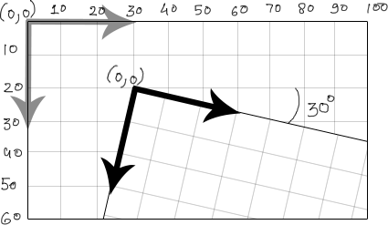

# (Extreme) Game Development with Javascript

---

# Let's start with the basics

---

# ❓ gamedev... anyone? ❓

---

# Game loop

```js
while (true) {
  /* Update all game objects */
  updateScreen();
}
```

---

# Game loop #2

```js
while (true) {
  for (const gameObject of gameObjects) {
    gameObject.update();
  }
  updateScreen();
}
```

---

# Game loop #3

```js
function updateGame() {
  for (const gameObject of gameObjects) {
    gameObject.update();
  }
  updateCanvas();
  requestAnimationFrame(updateGame);
}

requestAnimationFrame(updateGame);
```

---

# Time management

```js
let lastTime = Date.now();
function updateGame() {
  const currentTime = Date.now();
  const deltaTime = currentTime - lastTime;
  lastTime = currentTime;

  for (const gameObject of gameObjects) {
    gameObject.update(deltaTime);
  }
  /* Update screen */
}
```

---

# Updating objects
# =
### Changing rotation, position, scale!

---

## Game as cartesian plane



---

# Who does all of this stuff?

---

# We need a game engine
### Let's use Phaser!

---

# Why Phaser?

* Easy to learn
* Open source
* It's Javascript
* It's fun!

---
# Basic concepts

* Scenes
* Game Objects & Factory
* Loader
* Physics
<!-- * Composition -->

---
## Scenes

A scene is a container for all the game objects. It can be a menu, a level, a game over screen, etc.

#### Example:
**Super Mario Bros** has a scene for the title screen, a scene for each level, and a scene for the game over screen.

---
## Scenes

```js
class MyScene extends Phaser.Scene
{
    constructor () {
      super(‘MyScene’);
    }
    preload () { /* Load assets */ }
    create () { /* Create items */ }
    update (time, delta) { /* update items. */ }
}
```
---
## Scenes registration

```js

const config = {
  type: Phaser.AUTO,
  width: 800,
  height: 600,
  // Scene must be registered here
  scene: [MyScene]
};
const game = new Phaser.Game(config);
```
---
## Game Object

A game object is an entity that can be placed in a scene. It can be a sprite, a text, a group, an audio, etc.

They are implemented as classes inheriting from `Phaser.GameObject` and can be created using the **factory**.

---

## Factory

Inside a scene, you can create game objects using the factory, invoking `this.add`.

```js
create() {
  this.add.text(100, 100, 'Hello, Phaser!');
  this.add.sprite(400, 300, 'player');
  this.add.audio('music');
}
```

---

## Loader

To be able to use assets in your game, you need to load them first. You can do this in the `preload` method of a scene.

```js
preload() {
  /* choosing a symbolic name for the asset */
  this.load.image('player', 'assets/player.png');
}
...
/* later in the create method */
this.add.sprite(400, 300, 'player');
```

---
## Inputs #1

```js
create() {
  this.spaceKey = this.input.keyboard.addKey(
    Phaser.Input.Keyboard.KeyCodes.SPACE
  );
}

update() {
  if (this.spaceKey.isDown) {
    /* ... do stuff ... */
  }
}
```
---
## Inputs #2

```js
create() {
  this.spaceKey = this.input.keyboard.addKey(
    Phaser.Input.Keyboard.KeyCodes.SPACE
  );

  this.spaceKey.on('down', () => {
    /* ... do stuff ... */
  });
}

```
---
## Physics

### Arcade vs MatterJS

---
## Arcade Physics

```js
const config = {
  ...
  physics: {
    default: 'arcade',
  },
  ...
};

this.player = this.physics.add.sprite(400, 300, 'player');

/* ... */
this.player.body.setVelocityX(100);
```

---
## Collisions

```js
this.player = this.physics.add.sprite(400, 300, 'player');
this.ground = this.physics.add.staticImage(400, 568, 'ground');
this.platform.setImmovable(true);
this.platform.body.allowGravity = false;

this.physics.add.collider(this.player, this.ground, () => {
  console.log('Player hit the ground!');
});
```

---
# Workshop time!
### Let's make PONG!
---
## PONG Rules

- Two players (WASD and Arrow keys)
- Each player has a paddle
- A ball bounces between the paddles
- If the ball hits the wall behind a player, the other player scores
- First player to reach 10 points wins

---
# Useful links
- This Repo
https://github.com/ProGM/phaser-xp
- Phaser Cheatsheet
https://progm.github.io/phaser-xp/cheatsheet/
- Phaser Debugger
https://chromewebstore.google.com/detail/phaser-debugger/aigiefhkiaiihlploginlonehdafjljd
- Phaser Examples
https://labs.phaser.io/

---

## PONG Rules

- Two players (WASD and Arrow keys)
- Each player has a paddle
- A ball bounces between the paddles
- If the ball hits the wall behind a player, the other player scores
- First player to reach 10 points wins

---

# Part 2: XP and Video Game Industry...

---

# A sad story.

---

### Cultural problems
- Competition & management pressing for results
- Non-technical people involved
- (Historically) No interest for long-time maintenance

---

### Technical problems
- A lot of proprietary / licensed / obscure software
- No standardization (lack of tooling)
- Hard to test player experience
- You're testing the engine, not the game

---

# But... it's possible!

---

# Separation of concerns
* Game state
* Presentation
* Input handling

---
# Let's test Game State

---

# Other approaches
* MVC (Model-View-Controller)
* MVP (Model-View-Presenter)
* ECS (Entity-Component-System)
